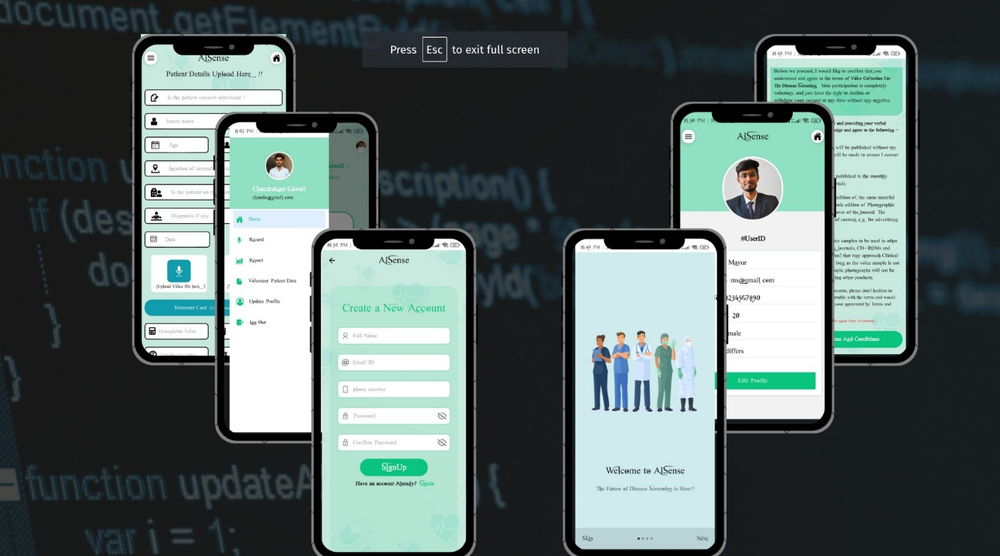

# Voice Analysis for Disease Screening

## Introduction
This project leverages voice analysis to screen for diseases, providing a non-invasive tool for early detection. The application is developed using React Native, allowing for cross-platform mobile app development. The backend is powered by Node.js, and the machine learning model is implemented in Python.

## Features
- **Voice Recording**: Users can record their voice directly within the app.
- **Analysis**: The voice is analyzed using a machine learning model to detect potential health issues.
- **Results**: Users receive instant feedback on their health status based on their voice analysis.

## Technology Stack
- **Frontend**: React Native
- **Backend**: Node.js
- **Machine Learning Model**: Python

